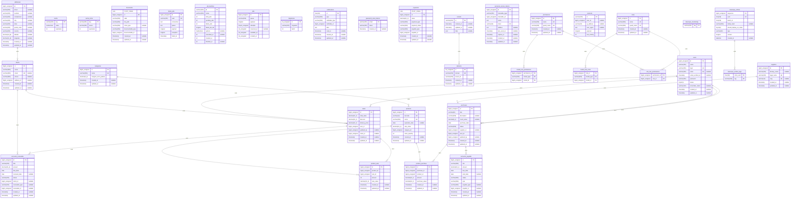

```mermaid
erDiagram
    accounts_payable {
        bigint_unsigned id PK
        varchar(255) title
        decimal(10_2) amount
        date due_date
        date paid_date "nullable"
        varchar(255) status
        varchar(255) type
        varchar(255) payable_type "nullable"
        bigint_unsigned payable_id "nullable"
        timestamp created_at "nullable"
        timestamp updated_at "nullable"
    }
    accounts_receivable {
        bigint_unsigned id PK
        varchar(255) title
        decimal(10_2) amount
        date due_date
        date received_date "nullable"
        varchar(255) status
        bigint_unsigned client_id "nullable"
        varchar(255) receivable_type "nullable"
        bigint_unsigned receivable_id "nullable"
        timestamp created_at "nullable"
        timestamp updated_at "nullable"
    }
    addresses {
        bigint_unsigned id PK
        varchar(255) street "nullable"
        varchar(255) number "nullable"
        varchar(255) complement "nullable"
        varchar(255) city "nullable"
        varchar(255) state "nullable"
        varchar(255) postal_code "nullable"
        varchar(255) country "nullable"
        decimal(10_8) latitude "nullable"
        decimal(11_8) longitude "nullable"
        timestamp created_at "nullable"
        timestamp updated_at "nullable"
    }
    cache {
        varchar(255) key PK
        mediumtext value
        int expiration
    }
    cache_locks {
        varchar(255) key PK
        varchar(255) owner
        int expiration
    }
    categories {
        bigint_unsigned id PK
        varchar(255) name UK
        decimal(5_2) margem_lucro_padrao
        timestamp created_at "nullable"
        timestamp updated_at "nullable"
    }
    clients {
        bigint_unsigned id PK
        varchar(255) name
        varchar(255) email UK "nullable"
        varchar(255) phone "nullable"
        bigint_unsigned address_id "nullable"
        timestamp created_at "nullable"
        timestamp updated_at "nullable"
    }
    documents {
        note PIVOT_TABLE
        bigint_unsigned id PK
        varchar(255) label
        varchar(255) file_path
        varchar(255) mime_type "nullable"
        varchar(255) documentable_type
        bigint_unsigned documentable_id
        timestamp created_at "nullable"
        timestamp updated_at "nullable"
    }
    domains {
        int_unsigned id PK
        varchar(255) domain UK
        varchar(255) tenant_id
        timestamp created_at "nullable"
        timestamp updated_at "nullable"
    }
    failed_jobs {
        bigint_unsigned id PK
        varchar(255) uuid UK
        text connection
        text queue
        longtext payload
        longtext exception
        timestamp failed_at
    }
    job_batches {
        varchar(255) id PK
        varchar(255) name
        int total_jobs
        int pending_jobs
        int failed_jobs
        longtext failed_job_ids
        mediumtext options "nullable"
        int cancelled_at "nullable"
        int created_at
        int finished_at "nullable"
    }
    jobs {
        bigint_unsigned id PK
        varchar(255) queue
        longtext payload
        tinyint_unsigned attempts
        int_unsigned reserved_at "nullable"
        int_unsigned available_at
        int_unsigned created_at
    }
    migrations {
        int_unsigned id PK
        varchar(255) migration
        int batch
    }
    notifications {
        char(36) id PK
        varchar(255) type
        varchar(255) notifiable_type
        bigint_unsigned notifiable_id
        text data
        timestamp read_at "nullable"
        timestamp created_at "nullable"
        timestamp updated_at "nullable"
    }
    model_has_permissions {
        bigint_unsigned permission_id PK
        varchar(255) model_type PK
        bigint_unsigned model_id PK
    }
    model_has_roles {
        bigint_unsigned role_id PK
        varchar(255) model_type PK
        bigint_unsigned model_id PK
    }
    password_reset_tokens {
        varchar(255) email PK
        varchar(255) token
        timestamp created_at "nullable"
    }
    payments {
        note PIVOT_TABLE
        bigint_unsigned id PK
        decimal(10_2) value
        varchar(255) payment_type
        varchar(255) payment_status
        varchar(255) payable_type
        bigint_unsigned payable_id
        timestamp created_at "nullable"
        timestamp updated_at "nullable"
    }
    permissions {
        bigint_unsigned id PK
        varchar(255) name UK
        varchar(255) guard_name UK
        timestamp created_at "nullable"
        timestamp updated_at "nullable"
    }
    personal_access_tokens {
        bigint_unsigned id PK
        varchar(255) tokenable_type
        bigint_unsigned tokenable_id
        text name
        varchar(64) token UK
        text abilities "nullable"
        timestamp last_used_at "nullable"
        timestamp expires_at "nullable"
        timestamp created_at "nullable"
        timestamp updated_at "nullable"
    }
    product_purchase {
        bigint_unsigned id PK
        bigint_unsigned purchase_id
        bigint_unsigned product_id
        decimal(10_2) amount
        decimal(10_2) purchase_value
        timestamp created_at "nullable"
        timestamp updated_at "nullable"
    }
    product_sale {
        bigint_unsigned id PK
        bigint_unsigned product_id
        bigint_unsigned sale_id
        int amount
        decimal(10_2) sale_value
        timestamp created_at "nullable"
        timestamp updated_at "nullable"
    }
    products {
        bigint_unsigned id PK
        varchar(14) barcode UK
        varchar(255) name UK
        date expiration_date "nullable"
        decimal(10_2) sale_value
        bigint_unsigned category_id
        int stock_quantity
        timestamp created_at "nullable"
        timestamp updated_at "nullable"
    }
    purchases {
        bigint_unsigned id PK
        varchar(50) title
        varchar(255) description "nullable"
        decimal(8_2) count_value "nullable"
        date purchase_date
        varchar(255) status
        bigint_unsigned supplier_id "nullable"
        bigint_unsigned user_id
        bigint_unsigned updated_by "nullable"
        timestamp created_at "nullable"
        timestamp updated_at "nullable"
    }
    role_has_permissions {
        bigint_unsigned permission_id PK
        bigint_unsigned role_id PK
    }
    roles {
        bigint_unsigned id PK
        varchar(255) name UK
        varchar(255) guard_name UK
        timestamp created_at "nullable"
        timestamp updated_at "nullable"
    }
    sales {
        bigint_unsigned id PK
        decimal(10_2) total_value
        decimal(10_2) discount
        decimal(10_2) delivery_price
        bigint_unsigned user_id
        bigint_unsigned updated_by "nullable"
        bigint_unsigned client_id "nullable"
        timestamp created_at "nullable"
        timestamp updated_at "nullable"
    }
    sessions {
        varchar(255) id PK
        bigint_unsigned user_id "nullable"
        varchar(45) ip_address "nullable"
        text user_agent "nullable"
        longtext payload
        int last_activity
    }
    suppliers {
        bigint_unsigned id PK
        varchar(255) fantasy_name "nullable"
        varchar(255) legal_name UK
        varchar(14) cnpj UK "nullable"
        timestamp created_at "nullable"
        timestamp updated_at "nullable"
    }
    telescope_entries {
        bigint_unsigned sequence PK
        char(36) uuid UK
        char(36) batch_id
        varchar(255) family_hash "nullable"
        tinyint(1) should_display_on_index
        varchar(20) type
        longtext content
        datetime created_at "nullable"
    }
    telescope_entries_tags {
        char(36) entry_uuid PK
        varchar(255) tag PK
    }
    telescope_monitoring {
        varchar(255) tag PK
    }
    tenants {
        varchar(255) id PK
        timestamp created_at "nullable"
        timestamp updated_at "nullable"
        json data "nullable"
    }
    users {
        bigint_unsigned id PK
        varchar(255) name
        varchar(255) login UK
        varchar(255) email UK "nullable"
        timestamp email_verified_at "nullable"
        varchar(255) password
        tinyint(1) status
        varchar(100) remember_token "nullable"
        timestamp created_at "nullable"
        timestamp updated_at "nullable"
    }
    addresses ||--o{ clients : "uses"
    clients ||--o{ accounts_receivable : "uses"
    tenants ||--o{ domains : "uses"
    permissions ||--o{ model_has_permissions : "uses"
    roles ||--o{ model_has_roles : "uses"
    products ||--o{ product_purchase : "uses"
    purchases ||--o{ product_purchase : "uses"
    products ||--o{ product_sale : "uses"
    sales ||--o{ product_sale : "uses"
    purchases ||--o{ accounts_payable : "uses"
    sales ||--o{ accounts_receivable : "uses"
    categories ||--o{ products : "uses"
    suppliers ||--o{ purchases : "uses"
    users ||--o{ purchases : "uses"
    users ||--o{ purchases : "uses"
    permissions ||--o{ role_has_permissions : "uses"
    roles ||--o{ role_has_permissions : "uses"
    clients ||--o{ sales : "uses"
    users ||--o{ sales : "uses"
    users ||--o{ sales : "uses"
    telescope_entries ||--o{ telescope_entries_tags : "uses"
```
